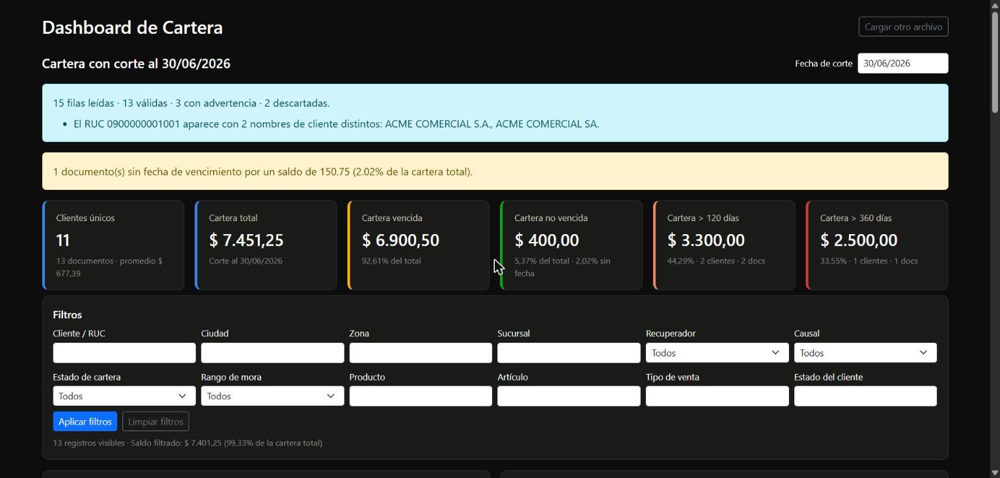
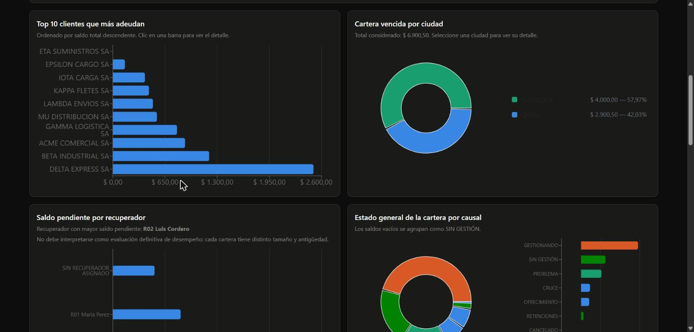
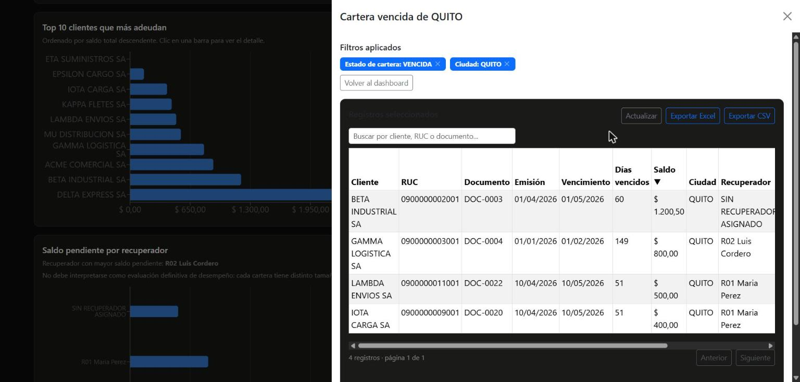

# Dashboard de Cartera

Aplicación web para cargar un Excel de cartera de clientes, validar su estructura, mapear
columnas, procesarlo y generar un dashboard ejecutivo con KPIs, gráficos, filtros, tabla de
detalle y exportación — protegida por autenticación JWT, con usuarios, roles y permisos
configurables (integración con `skelleton_base`, ver `docs/integracion/`).





*(Capturas generadas con el archivo sintético de pruebas `backend/cartera/tests/fixtures/cartera_ejemplo.xlsx`, sin datos reales de clientes.)*

## Objetivo

Permitir que un usuario no técnico cargue un archivo Excel de cartera, corrija manualmente el
mapeo de columnas si algún encabezado tiene un nombre distinto al esperado, y obtenga de forma
automática: cartera vencida/no vencida, mora por antigüedad (120/360 días), top 10 clientes,
cartera vencida por ciudad (gráfico de pastel), ranking de recuperadores, estado de la cartera
por causal y una matriz cruzada de recuperador × causal — todo filtrable, exportable y, además,
**interactivo**: cualquier gráfico, tarjeta KPI o celda de la matriz se puede seleccionar para
abrir el detalle de los registros que lo componen (ver `docs/dashboard.md`).

## Arquitectura

- **Frontend**: React 19 (Vite) + React Router 7 + React-Bootstrap + Recharts + Axios. `frontend/`
- **Backend**: Django 5 + Django REST Framework (patrón MVT). `backend/`
- **Autenticación**: JWT (`djangorestframework-simplejwt`) + hash Argon2 + sesiones propias
  revocables (`apps.authentication`), con usuarios (`apps.users`), roles (`apps.roles`, sobre
  `Group` nativo de Django) y un catálogo cerrado de permisos (`apps.permissions`) — integrado
  desde `skelleton_base` (ver `docs/integracion/`).
- **Identidad institucional**: configuración de marca (nombre, logo, colores, tipografía)
  editable desde `/admin/settings` y aplicada en toda la app vía `ThemeContext` (`apps.branding`).
- **Procesamiento de Excel**: pandas + openpyxl (.xlsx) + xlrd (.xls)
- **Base de datos**: SQL Server (vía `mssql-django` + `pyodbc`)
- **Pruebas backend**: Django Test (`APITestCase` / `TestCase`)
- **Pruebas frontend**: Vitest + React Testing Library
- **Casos de aceptación**: Gherkin (`tests/qa/dashboard_cartera.feature`,
  `tests/qa/features/dashboard-portfolio-drilldown.feature`,
  `tests/qa/features/dashboard-visual-editor.feature`,
  `tests/qa/dashboard_matrices_pagination.feature`,
  `tests/qa/skelleton_base_integration.feature`)

### Autenticación, usuarios, roles y permisos

El dashboard de Cartera **exige sesión** (`IsAuthenticated` global en DRF) y el permiso
`dashboard.view`. Todo vive en apps nuevas bajo `backend/apps/` (conviven con `cartera`, que no
se movió ni se reescribió):

| App | Responsabilidad |
|---|---|
| `apps.core` | `BaseModel` abstracto, `AuditLog` genérico (auditoría de seguridad — login, altas/bajas de usuarios, cambios de rol/permiso), enmascarado de campos sensibles |
| `apps.permissions` | Catálogo cerrado de permisos (`catalog.py`, 20 entradas: 13 administrativas + los 7 `dashboard.*` que ya traía `cartera`), modelo ancla `ModulePermission`, clase DRF `HasModulePermission`/`require_permission(...)` |
| `apps.authentication` | Login/logout/logout-all/refresh/me/cambio de contraseña, modelo `Session` (revocación sin depender de la blacklist nativa de simplejwt), protección de fuerza bruta |
| `apps.users` | Modelo de usuario (`AbstractUser` extendido: `status` activo/deshabilitado/bloqueado, `must_change_password`), CRUD administrativo, protección del último administrador activo |
| `apps.roles` | Roles = `Group` nativo de Django; siembra el rol `ADMINISTRADOR_GENERAL` con el catálogo completo de permisos |
| `apps.branding` | Configuración institucional (`SiteTheme`, singleton) |

`cartera/permisos.py` sigue siendo el único punto que las vistas de `cartera` consultan
(`permisos.tiene_permiso(request, ...)`) — internamente resuelve permisos reales contra
`request.user` en vez de conceder todo sin verificar (decisión documentada en
`docs/integracion/decisions.md`). El acceso de un `ADMINISTRADOR_GENERAL` **no** depende del
nombre del rol: se resuelve siempre por los permisos efectivamente asignados.

El frontend consume esto vía `AuthContext` (sesión, `frontend/src/context/AuthContext.jsx`),
`RequirePermission` (protección de rutas por permiso puntual) y un panel de administración en
`/admin` (Usuarios, Roles, Permisos, Configuración institucional — ver más abajo).

Cada carga de Excel se valida y se inserta en SQL Server (`CargaArchivo` + `RegistroCartera`,
en lotes de ~2000 filas). Los endpoints de consulta (KPIs, gráficos, tabla) leen desde la base
—no vuelven a parsear el Excel— y usan pandas únicamente para las agregaciones, de modo que
cambiar la fecha de corte o un filtro no requiere reprocesar el archivo original.

**Drill-down**: no existe (ni existía) un router de páginas en el frontend, así que el detalle
de cualquier selección se implementó como un panel lateral reutilizable (`Offcanvas`), no como
una ruta nueva. El contrato de filtros (`useDrilldown`) y el mapeo gráfico→filtro completos
están documentados en `docs/dashboard.md`.

### Estructura de carpetas

```
backend/
  config/                 # settings, urls, wsgi
  cartera/
    models.py             # CargaArchivo, RegistroCartera, DashboardLayout/Component/AuditLog
    views.py, dashboard_views.py, dashboard_registry.py, permisos.py, urls.py
    services/             # excel_reader, column_mapper, validators, ingest,
                           # calculator, aggregations, export_service, filters, dashboard_layout
    utils/                # normalization.py, dates.py
    management/commands/clean_temp_uploads.py
    tests/                # Django Test + fixture sintético
  apps/                   # integración con skelleton_base (docs/integracion/)
    core/                 # BaseModel, AuditLog genérico, enmascarado de datos sensibles
    permissions/          # catalog.py, ModulePermission, HasModulePermission
    authentication/       # Session, LoginAttempt, login/refresh/logout/me
    users/                # modelo de usuario, CRUD administrativo
    roles/                # Group + siembra de ADMINISTRADOR_GENERAL
    branding/              # SiteTheme (identidad institucional)

frontend/
  src/
    pages/
      CarteraDashboardPage.jsx
      authentication/LoginPage.jsx
      dashboards/DashboardsListPage.jsx
      administration/{users,roles,permissions,settings}/
    components/{upload,mapping,kpi,charts,filters,table,drilldown,common}/
    components/{auth,admin}/       # RequirePermission, AuthenticatedLayout, AdminLayout/Sidebar
    context/{AuthContext,ThemeContext}.jsx
    routes/AppRoutes.jsx
    config/adminMenu.js
    hooks/useDrilldown.jsx, useDetalleCartera.js, useCarteraDashboard.js, useAdminMenu.js
    services/, utils/, tests/

tests/
  qa/dashboard_cartera.feature
  qa/features/dashboard-portfolio-drilldown.feature
  qa/features/dashboard-visual-editor.feature
  qa/dashboard_matrices_pagination.feature
  qa/skelleton_base_integration.feature
  qa/acceptance-criteria-traceability*.md
  qa/test-execution-report*.md
docs/                     # dashboard.md, api-reference.md, capturas
docs/integracion/         # comparación, matriz de migración, plan, decisiones, informe final
```

## Dependencias

**Backend** (`backend/requirements.txt`): Django, djangorestframework,
djangorestframework-simplejwt, django-cors-headers, mssql-django, pyodbc, pandas, openpyxl,
xlrd, python-dateutil, python-dotenv, argon2-cffi (hash de contraseñas).

**Frontend** (`frontend/package.json`): react, react-dom, react-router-dom, react-bootstrap,
bootstrap, recharts, axios; devDependencies: vite, vitest, @testing-library/react,
@testing-library/jest-dom, @testing-library/user-event, jsdom.

## Instalación

### Requisitos previos

- Python 3.11+
- Node.js 20+ / npm
- SQL Server accesible (local, Docker o remoto) y **ODBC Driver 17 for SQL Server** instalado.
- Una base de datos ya creada (el proyecto no la crea, solo las tablas vía migraciones).

### Backend

```bash
cd backend
python -m venv .venv
.venv/Scripts/activate        # Windows: .venv\Scripts\activate
pip install -r requirements.txt
cp .env.example .env           # y completar credenciales reales
python manage.py migrate
python manage.py createsuperuser   # necesario: el dashboard exige sesión (ver "Autenticación")
python manage.py runserver 8000
```

El primer `migrate` también siembra el rol `ADMINISTRADOR_GENERAL` (con el catálogo completo de
permisos) y la configuración institucional por defecto — no requieren pasos manuales.

### Frontend

```bash
cd frontend
npm install
npm run dev                    # http://localhost:5173, con proxy /api -> :8000
```

## Variables de entorno (`backend/.env`)

| Variable | Descripción |
|---|---|
| `DEBUG` | `True`/`False` |
| `SECRET_KEY` | Clave secreta de Django |
| `ALLOWED_HOSTS` | Hosts permitidos, separados por coma |
| `DB_ENGINE` | `mssql` (por defecto) o `sqlite` para desarrollo sin SQL Server |
| `DB_NAME`, `DB_USER`, `DB_PASSWORD`, `DB_HOST`, `DB_PORT` | Conexión a SQL Server |
| `DB_ENCRYPT`, `DB_TRUST_SERVER_CERTIFICATE` | Opciones de cifrado ODBC (`Encryption: Optional` ≈ `DB_ENCRYPT=no` + `DB_TRUST_SERVER_CERTIFICATE=yes`) |
| `CORS_ALLOWED_ORIGINS` | Orígenes permitidos para el frontend |
| `UPLOAD_MAX_SIZE_BYTES` | Tamaño máximo de archivo de carga |
| `JWT_SECRET_KEY` | Clave de firma de los tokens JWT (por defecto, `SECRET_KEY`) |
| `JWT_ACCESS_TOKEN_LIFETIME_MINUTES` | Vigencia del access token (por defecto 15 min) |
| `JWT_REFRESH_TOKEN_LIFETIME_DAYS` | Vigencia del refresh token (por defecto 7 días) |
| `JWT_ALGORITHM` | Algoritmo de firma (por defecto `HS256`) |
| `LOGIN_MAX_FAILED_ATTEMPTS` | Intentos fallidos antes de bloquear temporalmente (por defecto 5) |
| `LOGIN_LOCKOUT_MINUTES` | Minutos de bloqueo tras exceder los intentos (por defecto 15) |
| `EMAIL_BACKEND` | Por defecto, backend de consola (`django.core.mail.backends.console.EmailBackend`) — nunca se envía correo real sin configurar explícitamente un SMTP |
| `EMAIL_HOST`, `EMAIL_PORT`, `EMAIL_HOST_USER`, `EMAIL_HOST_PASSWORD`, `EMAIL_USE_TLS`, `EMAIL_USE_SSL` | Configuración SMTP para recuperación de contraseña |
| `DEFAULT_FROM_EMAIL` | Remitente de los correos del sistema |
| `FRONTEND_URL` | Dominio base para el enlace de recuperación de contraseña — nunca hardcodeado |
| `PASSWORD_RESET_TOKEN_LIFETIME_MINUTES` | Vigencia del token de recuperación (por defecto 30 min) |
| `PASSWORD_RESET_THROTTLE_RATE` | Límite de solicitudes de recuperación por IP (por defecto `5/hour`) |

Con `DB_ENGINE=sqlite` el proyecto corre sin SQL Server (útil para probar rápido); el resto del
código no cambia, ya que Django ORM abstrae el motor.

## Estructura esperada del Excel

27 columnas (ver `cartera/services/column_mapper.py`):

```
Sucursal, Lugar Geográfico, Zona, Alterno Cliente, Código cle, Cliente,
Vendedor / Ejecutivo Ventas, Estado Cliente, Ruc Cliente, Telefono, Dirección,
Número de Documento, Fecha de Vencimiento, Fecha de Emisión, Saldo, Articulo,
VENCE, OBSERVACION, Mes, Tipo de Venta, Causal, Producto, Fecha compromiso pago,
Observaciones, Tipo Cartera, Vendedor 3, Dias credito
```

### Columnas obligatorias

| Dato | Columna por defecto |
|---|---|
| Cliente | `Cliente` |
| Identificador | `Ruc Cliente` |
| Documento | `Número de Documento` |
| Fecha de vencimiento | `Fecha de Vencimiento` |
| Fecha de emisión | `Fecha de Emisión` |
| Saldo | `Saldo` |
| Ciudad | `Lugar Geográfico` |
| Recuperador | `Vendedor 3` |
| Causal | `Causal` |

El reconocimiento de encabezados ignora mayúsculas/minúsculas, tildes, espacios extra y guiones
bajos (`cartera/utils/normalization.py` + `column_mapper.py`), y **nunca** sugiere
`Vendedor / Ejecutivo Ventas` como recuperador — solo `Vendedor 3` se autodetecta para ese
campo, aunque el usuario puede reasignarlo manualmente en el mapeo si así lo decide.

## Reglas de cálculo

- **Identificador único de cliente**: `Ruc Cliente` → si vacío, `Código cle` → si vacío, nombre
  normalizado de `Cliente`.
- **Los espacios vacíos de la columna `Causal` se interpretan como cartera sin gestión**
  (`SIN GESTIÓN`), no se ocultan.
- **Recuperador vacío** → `SIN RECUPERADOR ASIGNADO`. **Ciudad vacía** → `SIN CIUDAD`.
- **Vencida**: `Fecha de Vencimiento <= fecha de corte` y `Saldo > 0`.
- **No vencida**: `Fecha de Vencimiento > fecha de corte` y `Saldo > 0`.
- **Días vencidos**: `fecha de corte - Fecha de Vencimiento` (recalculado siempre, no se usa la
  columna `VENCE` del Excel).
- **Mayor a 120 / 360 días**: días vencidos > 120 / > 360, con `Saldo > 0`.
- Saldos no convertibles a número se **descartan** de los cálculos (y se listan en el resumen
  de validación); saldos en cero o negativos se conservan y se clasifican como `SALDO CERO` /
  `SALDO A FAVOR`.

## Fecha de corte

Por defecto, el **último día calendario del mes anterior** a la fecha del servidor
(`cartera/utils/dates.py:fecha_corte_por_defecto`). Es editable desde la interfaz; al cambiarla,
todos los KPIs, gráficos, la matriz y la tabla se recalculan sin volver a leer el Excel.

## Endpoints

```
POST   /api/cartera/validar-archivo
POST   /api/cartera/procesar
GET    /api/cartera/resumen/<carga_id>
GET    /api/cartera/top-clientes/<carga_id>
GET    /api/cartera/pareto-ciudades/<carga_id>
GET    /api/cartera/recuperadores/<carga_id>
GET    /api/cartera/causales/<carga_id>
GET    /api/cartera/recuperadores-causales/<carga_id>?formato=chart|matriz&metrica=saldo|documentos|clientes
GET    /api/cartera/detalle/<carga_id>?page=&page_size=(5|10|25|50|100, fallback 10)&buscar=&ordering=&<filtros>
GET    /api/cartera/exportar/<carga_id>?formato=xlsx|csv&tipo=detalle|errores
DELETE /api/cartera/archivo/<carga_id>

GET    /api/dashboards/authorized                  # solo los dashboards que el usuario puede ver
GET    /api/dashboards/<dashboard_id>/layout
PUT    /api/dashboards/<dashboard_id>/layout
POST   /api/dashboards/<dashboard_id>/layout/reset
GET    /api/dashboards/<dashboard_id>/versions

# --- Autenticación, usuarios, roles, permisos, identidad institucional (integración con
# skelleton_base, ver docs/integracion/) ---
POST   /api/auth/login
POST   /api/auth/token/refresh
POST   /api/auth/logout
POST   /api/auth/logout-all
GET    /api/auth/me
POST   /api/auth/password/change
POST   /api/auth/password-reset/request            # { email } — respuesta siempre genérica
POST   /api/auth/password-reset/validate            # { token }
POST   /api/auth/password-reset/confirm             # { token, new_password, confirm_password }

GET    /api/users/                                 # ?q=&status=&role=&page=
POST   /api/users/
GET    /api/users/<id>/
PATCH  /api/users/<id>/
POST   /api/users/<id>/enable/ | disable/ | block/ | unblock/
POST   /api/users/<id>/roles/                      # { role_ids: [...] }
POST   /api/users/<id>/permissions/                # { codenames: [...] }

GET    /api/roles/
POST   /api/roles/
PATCH  /api/roles/<id>/
DELETE /api/roles/<id>/
GET    /api/roles/permissions-catalog/

GET    /api/permissions/                           # catálogo agrupado por módulo, solo lectura

GET    /api/branding/current                       # público — también lo usa /login
GET    /api/branding/admin
PATCH  /api/branding/admin
POST   /api/branding/admin/reset
GET    /api/branding/admin/options

GET    /api/audit/                                 # auditoría unificada — filtros: date_from/date_to/domain/action/result/severity/actor/dashboard_id/component_id/entity_type/entity_id/ip_address/q
GET    /api/audit/<id>/                            # detalle — oculta valores anteriores/nuevos/metadata sin auditoria.ver_detalle
GET    /api/audit/export/                          # CSV, requiere auditoria.exportar
```

Todos los endpoints anteriores (excepto `/api/auth/login`, `/api/auth/token/refresh` y
`/api/branding/current`, explícitamente públicos) exigen un `Authorization: Bearer <token>`
válido; los de `cartera`/`dashboards` exigen además el permiso `dashboard.*` correspondiente, y
los de `users`/`roles`/`permissions`/`branding` exigen su propio permiso administrativo
(`usuarios.*`, `roles.*`, `permisos.ver`, `configuracion.*`).

Todos los GET de agregaciones aceptan como query params opcionales: `fecha_corte`, `cliente`,
`ciudad`, `zona`, `sucursal`, `recuperador`, `causal`, `estado_cartera`, `rango_mora`,
`producto`, `articulo`, `tipo_venta`, `estado_cliente`, y (nuevos, para el drill-down)
`dias_vencidos_min`/`dias_vencidos_max`. `ciudad`/`causal`/`recuperador`/etc. aceptan una lista
separada por comas (`ciudad=QUITO,CUENCA`) para filtrar por "cualquiera de estos" — lo usa el
drill-down de la categoría "Otras ciudades"/"OTRAS". Ver `docs/api-reference.md` para el detalle
completo, incluida la nueva forma de respuesta de `/pareto-ciudades` (gráfico de pastel).

## Editor visual del dashboard

El botón **"Editar dashboard"** (visible según permisos, ver abajo) activa un modo de edición que
permite personalizar la presentación del dashboard sin tocar los datos ni las consultas.

### Modo edición

Al activarlo, cada componente (KPI, gráfico, filtro, mensaje, alerta, tabla o título) muestra un
borde punteado con: una manija de arrastre (⠿, accesible por teclado vía `dnd-kit`), botones
`« ‹ › »` para mover el componente al inicio/arriba/abajo/al final (alternativa accesible al
arrastre, siempre disponible), un engranaje que abre el panel de configuración, y un botón
Ocultar/Mostrar. La barra superior ofrece **Vista previa** (oculta el chrome de edición para ver
el resultado final, sin ninguna llamada al backend), **Restablecer diseño**, **Cancelar** y
**Guardar cambios**; cancelar con cambios sin guardar y restablecer piden confirmación en un
modal (nunca `window.confirm`).

### Personalización por componente

El panel de configuración (engranaje) permite editar, por componente: **título**, **descripción**,
**ancho** (selector discreto: 2/3/4/6/8/9/12 de 12 columnas — no hay arrastre libre de bordes en
píxeles, que sería menos accesible y podría producir superposiciones), **alto** (presets
Pequeño/Mediano/Grande o un valor personalizado en píxeles, mínimo 60px) y **colores** (principal,
vencido, no vencido, sin gestión, texto y fondo — validados como hex `#RGB`/`#RRGGBB` o `rgba(...)`
tanto en frontend como en backend). El panel de filtros tiene además su propia lista de
reordenamiento (mover arriba/abajo) para sus 16 campos, independiente de la cuadrícula principal
de componentes. **No** se puede cambiar el tipo de gráfico (Recharts con tipo fijo por
componente) — ver "Fuera de alcance" abajo.

### Paginación de tablas

Todas las tablas/matrices del dashboard (hoy: la tabla de detalle de documentos y la matriz de
recuperadores × causales) comparten un selector reutilizable de "registros por página"
(`frontend/src/components/common/Pagination.jsx`). Las opciones permitidas son siempre **5, 10,
25, 50 y 100**; si un componente no tiene configuración propia, o su configuración es inválida, se
usa **10** como valor por defecto — nunca se aceptan valores arbitrarios escritos a mano.

- **Configuración por componente**: cada `DashboardComponent` de tipo `table` guarda en su
  `config` los campos `defaultPageSize` y `allowedPageSizes` (además de `paginationEnabled`). Se
  edita desde el mismo panel de propiedades del modo edición ("Registros visibles por defecto") y
  se persiste igual que título/color/tamaño — solo al pulsar "Guardar cambios". El backend
  (`dashboard_layout.validar_componentes`) sanea cualquier valor fuera de {5,10,25,50,100} sin
  lanzar error, cayendo a 10.
- **Preferencia temporal de sesión**: cambiar el selector mientras se visualiza el dashboard (fuera
  del modo edición) solo actualiza estado local de React — no modifica ni persiste la
  configuración general del componente. Solo un usuario en modo edición que pulse "Guardar" cambia
  el valor por defecto para todos.
- **Paginación backend** (`tabla-detalle` / `DetalleTable`): el frontend envía `page`/`page_size` a
  `GET /api/cartera/detalle/<carga_id>`; el backend valida `page_size` contra las 5 opciones
  permitidas (fallback 10) y solo consulta/pagina las filas de esa página, sin traer el dataset
  completo.
- **Paginación frontend** (`tabla-matriz-recuperador-causal` / `RecuperadorCausalMatrix`): la
  matriz pivote (recuperadores × causales) la calcula el backend completa en cada consulta (no es
  practico paginarla en el servidor porque los totales de fila/columna dependen del dataset
  entero); el selector solo pagina, en memoria, qué filas de recuperadores se muestran — los
  totales por columna y el total general siempre reflejan el dataset completo filtrado, sin
  importar la página visible.
- **Integración con filtros/orden/búsqueda**: cambiar el tamaño de página siempre regresa a la
  página 1 mientras mantiene filtros, orden y búsqueda activos (mismo mecanismo que ya usan esos
  tres al cambiar: disparan una nueva consulta a página 1).
- **Exportación**: exportar (`ExportarView`, botones "Exportar Excel"/"Exportar CSV") ignora por
  completo el `page_size` de pantalla — siempre exporta el total de resultados filtrados, nunca
  solo la página visible.

### Sistema de cuadrícula

`EditableGrid` usa un único contenedor `flex-wrap`: cada componente reserva una fracción de
`ancho/12` y el propio `flex-wrap` acomoda todo automáticamente al reordenar, ocultar o cambiar de
ancho — no existen coordenadas fila/columna que mantener a mano, así que **nunca puede haber
superposición ni huecos que reorganizar**. El `order` de cada componente es una secuencia global
única (no se reinicia por fila); `row` se recalcula solo para guardarlo en el backend
(auditoría/compatibilidad de esquema) y no gobierna el renderizado.

### Persistencia, auditoría y versionado

"Guardar cambios" envía todo el layout como una única operación atómica (no hay endpoint por
componente) junto con un nombre libre para auditoría (por defecto "Anónimo", ya que no hay
sistema de usuarios). El backend valida la versión enviada contra la versión actual guardada: si
alguien más guardó primero, responde `409` y el frontend ofrece recargar la configuración más
reciente en vez de sobrescribirla silenciosamente. Cada guardado incrementa la versión y registra
en `DashboardAuditLog` quién hizo el cambio, cuándo, y el tipo de cambio por componente (orden,
tamaño, color, texto, visibilidad, restablecido). "Restablecer diseño" reemplaza la configuración
por el diseño predeterminado (definido en código en
`backend/cartera/services/dashboard_layout.py`, no en datos de migración) para **todos los
usuarios**, y también queda registrado en el historial — no se puede deshacer.

### Permisos

Los 7 permisos (`dashboard.view`, `dashboard.edit`, `dashboard.layout.edit`,
`dashboard.component.style`, `dashboard.component.create`, `dashboard.component.delete`,
`dashboard.configuration.reset`) están modelados como constantes y se verifican en un único punto
en cada capa: `usePermisos()` en el frontend y `cartera/permisos.py` en el backend. Desde la
integración con `skelleton_base` (ver "Autenticación, usuarios, roles y permisos" más arriba),
ese único punto resuelve permisos reales contra el usuario autenticado — como todo el editor
(frontend y backend) sigue consultando exclusivamente esa función, el resto de la lógica del
editor no tuvo que cambiar.

### Fuera de alcance (documentado explícitamente, no simulado)

- **Cambio de tipo de gráfico**: los gráficos son componentes React (Recharts) con tipo fijo; el
  campo `chart_type` está modelado en el esquema para el futuro pero la UI no ofrece cambiarlo.
- **Restaurar una versión anterior** desde el historial de auditoría: se puede consultar
  (`GET /api/dashboards/<id>/versions`) pero no hay una acción de "volver a esta versión" en la UI.
- **Layouts por rol o por usuario** (`scope=POR_ROL`/`POR_USUARIO`): el modelo los contempla pero
  solo `GENERAL` está implementado, coherente con la ausencia de autenticación real.

## Ejecución de pruebas

```bash
# Backend (normalización, cálculo, agregaciones, validadores, filtros de drill-down, API
# completa —incluida la validación de page_size—, layout/permisos/auditoría del editor visual
# —incluida la configuración de paginación por componente—)
cd backend
python manage.py test cartera

# Frontend (carga de archivo, mapeo, KPIs, formato, gráficos interactivos, panel de
# drill-down, estados de carga/error/sin-resultados, editor visual del dashboard, componente
# reutilizable de paginación y su integración en DetalleTable/RecuperadorCausalMatrix)
cd frontend
npm run test
```

Pruebas nuevas relacionadas con la paginación configurable: `Pagination.test.jsx` (componente
reutilizable), casos añadidos en `DetalleTable.test.jsx` y `RecuperadorCausalMatrix.test.jsx`
(selector, botones primera/última, mantener totales al paginar en memoria), casos en
`ComponentPropertiesPanel.test.jsx` (selector de "Registros visibles por defecto"), y en backend
`test_api.py` (`page_size`/`page` inválidos usan el valor por defecto sin error 500) y
`test_dashboard_layout.py` (saneo de `defaultPageSize`/`allowedPageSizes`, auditoría de cambios de
configuración).

Pruebas de la integración con `skelleton_base` (autenticación, usuarios, roles, permisos,
identidad institucional): `apps/*/tests.py` en el backend (login/logout/refresh/fuerza bruta,
CRUD de usuarios/roles, catálogo de permisos, `SiteTheme`) y, en el frontend,
`httpClient.test.jsx`, `AuthContext.test.jsx`, `RequirePermission.test.jsx`, `LoginPage.test.jsx`,
`ThemeContext.test.jsx`, `adminMenu.test.js`, `AdminSidebar.test.jsx` y las páginas de
administración (`UsersListPage`/`UserFormPage`/`RolesListPage`/`RoleFormPage`/
`PermissionsPage`/`SettingsPage`).

Los criterios de aceptación en Gherkin están en `tests/qa/dashboard_cartera.feature`,
`tests/qa/features/dashboard-portfolio-drilldown.feature`,
`tests/qa/features/dashboard-visual-editor.feature`,
`tests/qa/dashboard_matrices_pagination.feature` y
`tests/qa/skelleton_base_integration.feature` (documentan el comportamiento esperado; están
cubiertos por las pruebas automatizadas de arriba y, para lo que no es automatizable en jsdom —
hover de tooltip, clics sobre marcas SVG de Recharts, arrastre real con `dnd-kit`, layout real en
un viewport móvil —, por verificación manual en navegador). El detalle criterio-por-criterio y qué
se ejecutó realmente está en `tests/qa/acceptance-criteria-traceability.md`,
`tests/qa/acceptance-criteria-traceability-visual-editor.md`,
`tests/qa/acceptance-criteria-traceability-pagination.md`,
`tests/qa/acceptance-criteria-traceability-skelleton.md` y `tests/qa/test-execution-report.md`.

## Seguridad

Extensión + firma de archivo validadas (bloquea `.xlsm`/macros), nombre de archivo temporal
aleatorio (UUID, nunca el original), `carga_id` validado como UUID existente antes de cualquier
operación de archivo, límite de tamaño configurable, sanitización de celdas que empiecen con
`= + - @` al exportar (anti inyección de fórmulas), borrado del archivo temporal tras procesar o
al eliminar la carga. El comando `python manage.py clean_temp_uploads --horas N` elimina
archivos temporales huérfanos (cargas validadas pero nunca procesadas).

**Autenticación y autorización** (`apps.authentication`/`apps.permissions`, integración con
`skelleton_base`): contraseñas nunca en texto plano (hash Argon2, `PASSWORD_HASHERS`), tokens JWT
de vida corta (15 min de acceso / 7 días de refresh) con revocación real vía el modelo `Session`
(no depende de la blacklist genérica de simplejwt), protección de fuerza bruta por identificador
(no por usuario resuelto, evita enumeración) con hash señuelo para igualar tiempos de respuesta,
`DEFAULT_PERMISSION_CLASSES = [IsAuthenticated]` global (todo endpoint exige sesión salvo
`AllowAny` explícito en login/refresh/tema público), y cada denegación de permiso a un usuario ya
autenticado queda auditada (`apps.core.AuditLog`, acción `access_denied`).

## Limitaciones conocidas

- **Teclado en marcas SVG**: los sectores/barras/segmentos de Recharts no son focalizables de
  forma nativa. El drill-down por teclado funciona en las tarjetas KPI, las celdas de la matriz
  y las leyendas-lista del pastel y de causales; `RecuperadoresChart`, `TopClientesChart` y
  `RecuperadorCausalChart` solo abren su detalle con mouse/touch por ahora (ver
  `docs/dashboard.md`).
- **Procesamiento síncrono**: la carga se inserta en SQL Server en lotes dentro del mismo
  request HTTP (no hay cola de tareas tipo Celery); el frontend muestra un spinner mientras
  dura la operación. Para archivos de cientos de miles de filas esto sigue siendo del orden de
  segundos, pero un progreso porcentual en tiempo real requeriría infraestructura adicional no
  incluida en este alcance.
- **Filtros de texto libre** (ciudad, zona, sucursal, producto, artículo, tipo de venta, estado
  del cliente) requieren coincidencia exacta (insensible a mayúsculas); no hay autocompletado
  con los valores reales del archivo cargado.
- El archivo Excel real usado para validar esta implementación (con datos reales de clientes)
  **no se incluyó en el repositorio** por privacidad; las pruebas automatizadas usan
  `backend/cartera/tests/fixtures/cartera_ejemplo.xlsx`, un archivo sintético con la misma
  estructura de 27 columnas y datos ficticios que cubren los casos límite de la especificación.
- **Editor visual en pantalla angosta (móvil)**: no se verificó en un viewport móvil real durante
  esta sesión (ver limitación en
  `tests/qa/acceptance-criteria-traceability-visual-editor.md`, AC-EDT-026); queda como
  verificación pendiente.
- **Restaurar una versión anterior del historial de auditoría** no está implementado en la UI
  (solo consultar el historial); ver "Fuera de alcance" en la sección del editor visual.

### Limitaciones de la integración con `skelleton_base` (ver `docs/integracion/` para el detalle)

- **Menú administrativo estático en el frontend** (filtrado por permiso, mismo patrón que traía
  `skelleton_base`), no dinámico desde una tabla de menús en el backend — ocultar una opción no es
  la protección real; cada página y cada endpoint vuelven a exigir el permiso por su cuenta.
- **Sin Docker**: `skelleton_base` traía `docker-compose.yml`/`Dockerfile`; no se adoptaron en
  esta integración por no ser parte del flujo de desarrollo actual de `cms_dashboards`.

Las limitaciones que hasta el 2026-07-30 figuraban aquí (sin landing pública ni recuperación de
contraseña, dos sistemas de auditoría sin unificar, colores de Bootstrap no conectados) se
resolvieron el 2026-07-31 como "trabajo futuro post-integración" — ver
`docs/integracion/migration_report.md` (sección "Trabajo futuro completado") y
`docs/integracion/future_work_completion_report.md`.
